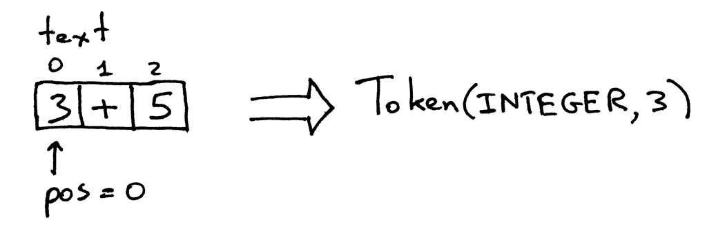

# Project 1: `calc1.py`

## Objective

In this project, we are going to implement a minimal interpreter for a calculator that handles addition only. For example:

```shell
$ python calc1.py
calc> 3+4
7
calc> 3+5
8
calc> 3+9
12
calc>
```

The input needs to follow certain rules:

- Only single digit integers are allowed in the input
- The only arithmetic operation supported at the moment is addition
- No whitespace characters are allowed anywhere in the input

## Lexical Analysis

When the interpreter takes an input string, the very first step is breaking the string into **tokens**. For example, the input string is "3+5", then the tokens are:

- An integer `3`
- An operator `+`
- An integer `5`

This process is called **"lexical analysis"/"scanning"/"tokenizing"**, all mean the same thing. Therfore the module that handles this task is called **"lexer"/"scanner"/"tokenizer"**, same story. 

## Design

Think of the input string as a char array. A pointer starts from the left and handles each character one by one. Pictorially:




We define two classes:

- The `Token` class
  - Defines **token type** and **token value**.
  - Token type can be 'INTEGER', 'PLUS', or 'EOF'.
  - Token value can be 0, 1, 2. 3, 4, 5, 6, 7, 8, 9, '+', or `None`.
- The Interpreter class
  - Defines a **"pointer"** `pos` (this is actually an index) and a few useful methods for interpreting the input string.
  - `get_next_token()`: recognizes the current token and move the pointer to the right.
  - `eat()`: Verify the current toke type and move to the next token.
  - `expr()`: Parsing and interpreting.
