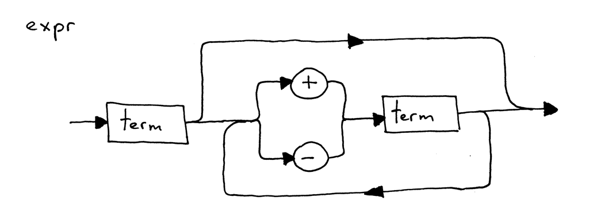

# Project 3: Calculator v3

## Objective

Let the interpreter parse (recognize) and interpret arithmetic expressions that have any number of plus or minus operators in it, for example "7 - 3 + 2 - 1".

## Syntax Diagram

A **syntax diagram** is a graphical representation of a programming language's syntax rules. Basically, a syntax diagram visually shows you which statements are allowed in your programming language and which are not. Syntax diagrams serve two main purposes:

- They graphically represent the specification (grammar) of a programming language.
- They can be used to help you write your parser. You can map a diagram to code by following simple rules.

Here is an example:

You can read the above syntax diagram as following: a term optionally followed by a plus or minus sign, followed by another term, which in turn is optionally followed by a plus or minus sign followed by another term and so on. According to the syntax diagram above, all of the following arithmetic expressions are valid:

- 3
- 3 + 4
- 7 - 3 + 2 - 1

Syntax diagrams serve two main purposes:

- They graphically represent the specification (grammar) of a programming language.
- They can be used to help you write your parser. You can map a diagram to code by following simple rules.

## Design

- Add a new method `term()`: Return an `INTEGER` token value.
- Refactor the method `expr()` using a while loop.

## Exercises

- [x] Draw a syntax diagram for arithmetic expressions that contain only multiplication and division, for example "7 * 4 / 2 * 3". Seriously, just grab a pen or a pencil and try to draw one.
- [x] Modify the source code of the calculator to interpret arithmetic expressions that contain only multiplication and division, for example "7 * 4 / 2 * 3".
- [x] Write an interpreter that handles arithmetic expressions like “7 - 3 + 2 - 1” from scratch. Use any programming language you’re comfortable with and write it off the top of your head without looking at the examples. When you do that, think about components involved: a lexer that takes an input and converts it into a stream of tokens, a parser that feeds off the stream of the tokens provided by the lexer and tries to recognize a structure in that stream, and an interpreter that generates results after the parser has successfully parsed (recognized) a valid arithmetic expression. String those pieces together. Spend some time translating the knowledge you’ve acquired into a working interpreter for arithmetic expressions.
