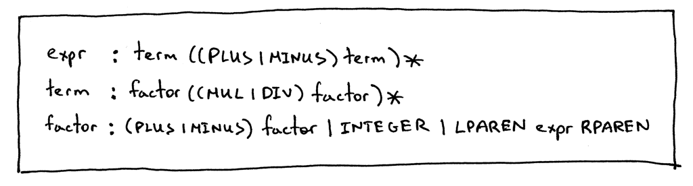

# Project 8: PIP v2

## Objective

The topic for this project is **unary operators**, namely unary plus (`+`) and unary minus (`-`) operators. We are going to:

- Extend the grammar to handle unary plus and unary minus operators
- Add a new `UnaryOp` AST node class
- Extend the parser to generate an AST with `UnaryOp` nodes
- Extend the interpreter and add a new `visit_UnaryOp` method to interpret unary operators

## Unary Operator

A **unary operator** is an operator that operates on one operand only. Here are the rules for unary plus and unary minus operators:

- The unary minus (`-`) operator produces the negation of its numeric operand
- The unary plus (`+`) operator yields its numeric operand without change
- The unary operators have **higher precedence** than the binary operators `+`, `-`, `*`, and `/`

The new grammar:



## Design

Add an AST node class to represent unary operators:

```python
class UnaryOp(AST):
    def __init__(self, op, expr):
        self.token = self.op = op
        self.expr = expr
```

Update `Parser.factor()`:

```python
def factor(self):
    """factor : (PLUS | MINUS) factor | INTEGER | LPAREN expr RPAREN"""
    token = self.current_token
    if token.type == PLUS:
        self.eat(PLUS)
        node = UnaryOp(token, self.factor())
        return node
    elif token.type == MINUS:
        self.eat(MINUS)
        node = UnaryOp(token, self.factor())
        return node
    elif token.type == INTEGER:
        self.eat(INTEGER)
        return Num(token)
    elif token.type == LPAREN:
        self.eat(LPAREN)
        node = self.expr()
        self.eat(RPAREN)
        return node
```

Extend the Interpreter class and add a `visit_UnaryOp` method to interpret unary nodes:

```python
def visit_UnaryOp(self, node):
    op = node.op.type
    if op == PLUS:
        return +self.visit(node.expr)
    elif op == MINUS:
        return -self.visit(node.expr)
```

## Exercises

- [x] Install [Free Pascal](https://www.freepascal.org/), compile and run testunary.pas, and verify that the results are the same as produced with your spi interpreter.
